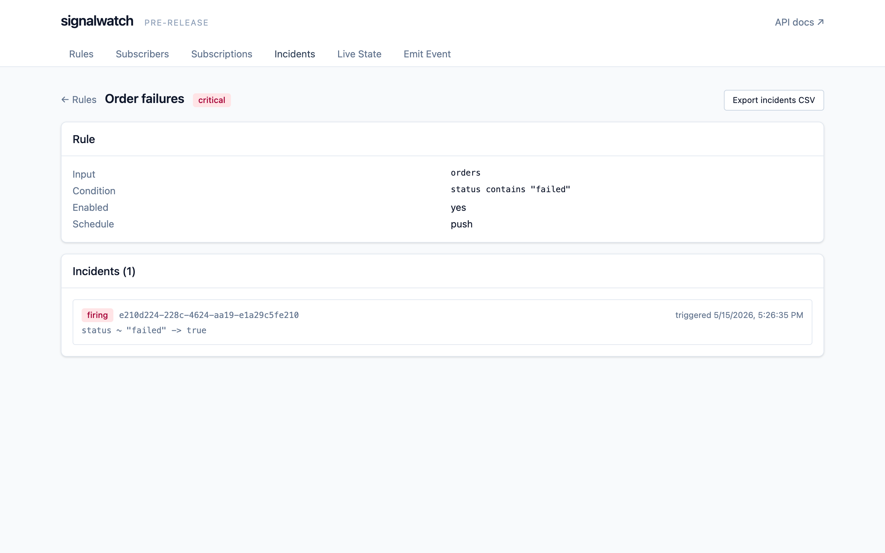

# signalwatch

> ✅ **`v0.4.0` shipped 2026-05-13.** First published release. Closes Program Increment 3 ("Production hardening + cloud scale"). See [`CHANGELOG.md`](./CHANGELOG.md) for everything that landed; [`docs/PI-PLAN.md`](./docs/PI-PLAN.md) for the per-sprint breakdown.

An open-source alert and notifications framework. Define rules over pushed events, scheduled SQL queries, scraped metrics, or message-queue streams. Notify subscribers on Slack, email, or any webhook. Ships as a single-binary service with a bundled UI, or as a Go library embeddable into your own application.

## Why

Most alerting tools assume your alerts come from one place — Prometheus metrics, log streams, or a SaaS event pipeline. signalwatch is built around the idea that alerts have many sources:

- An app pushes an event when a customer hits an error path.
- A SQL query against your operational database returns rows.
- The average MPG on a vehicle drops below 5 over the last 30 days.
- A queue message arrives matching a regex.

One tool, one rule model, one subscriber model. Pluggable everywhere.

## Highlights

- **One engine, two deploy shapes.** The engine is a Go library; the service binary is a thin wrapper around the same engine that adds an HTTP API and a bundled React UI.
- **Pluggable everything.** Inputs (event/SQL/scrape/stream), stores (SQLite/Postgres/MySQL/DuckDB), and channels (SMTP/Slack/webhook) are small Go interfaces — bring your own.
- **Per-subscription dwell, dedup, and repeat.** Different humans want different things from the same rule. signalwatch handles this on the subscription, not the rule.
- **SQLite by default.** Pure-Go driver, single-file binary, zero ops to get started.

## Status

| Layer | State |
|---|---|
| Engine, dispatcher (dwell/dedup/repeat), HTTP API, embedded UI, CLI | landed (PI 1) |
| Channels: SMTP, Slack, generic webhook, PagerDuty, MS Teams, Discord, Twilio SMS | landed (PI 1–2) |
| Inputs: event push, scheduled SQL, JSON scrape, Kafka, SQS, RabbitMQ, **AWS MSK (IAM-SASL)**, **Google Pub/Sub** | landed (PI 1–3) |
| Stores: SQLite (default), Postgres, MySQL; opt-in DuckDB datasource | landed (PI 1–2) |
| Rule conditions: threshold, window_aggregate, pattern_match, sql_returns_rows, **expression (expr-lang)** | landed (PI 1–2) |
| Per-rule incident drill-down UI + alert-history CSV/JSON export | landed (PI 2) |
| **Alert-history retention + archival (`json` / `webhook` sinks)** | landed (PI 3) |
| **OpenTelemetry tracing across engine / dispatcher / channels** | landed (PI 3) |
| **Per-user API tokens** (DB-stored, scoped `admin`/`read`, expiring); legacy shared token still accepted | landed (PI 3) |
| Cross-driver store conformance suite (`internal/store/storetest`) | landed |
| ≥90% repo coverage gate, 17-gate CICD on every PR | landed |
| Public repo, branch-protected `main`, signed-commits-only | landed |
| `v0.4.0` release tag | **shipped 2026-05-13** |

Full roadmap: [`docs/ROADMAP.md`](./docs/ROADMAP.md). Active sprint: [`docs/PI-PLAN.md`](./docs/PI-PLAN.md). What landed since v0.1: [`CHANGELOG.md`](./CHANGELOG.md).

## Quickstart (local development)

```bash
git clone https://github.com/ryan-evans-git/signalwatch
cd signalwatch
make build         # builds the React UI then the Go binaries
./bin/signalwatch --config examples/config.yaml
```

Open `http://localhost:8080/` for the UI. Push events to `http://localhost:8080/v1/events`.

### Locking down the API

By default `signalwatch` listens on the loopback interface and serves the API unauthenticated — fine for single-tenant local dev.

For shared deployments, signalwatch supports two complementary auth mechanisms:

1. **Per-user tokens** (recommended, v0.4+). Tokens are DB-stored with `admin`/`read` scopes and optional expiry. Issue / list / revoke via `/v1/auth/tokens` (admin-scoped). The raw secret is returned exactly once on issue; only `sha256(secret)` is persisted. See [`SECURITY.md`](./SECURITY.md).
2. **Shared token** (legacy, v0.1-style). Set `SIGNALWATCH_API_TOKEN` to require a single shared bearer on every `/v1/*` route. Treated as admin scope.

```bash
# Either or both:
export SIGNALWATCH_API_TOKEN=$(openssl rand -base64 32)   # optional legacy path
./bin/signalwatch --config examples/config.yaml
# Then issue a per-user token (returns the secret once):
curl -sX POST -H "Authorization: Bearer $SIGNALWATCH_API_TOKEN" \
  -H "Content-Type: application/json" \
  -d '{"name":"ci-deploybot","scopes":["admin"]}' \
  http://localhost:8080/v1/auth/tokens
```

`/healthz` and `/v1/auth-status` stay open regardless. The bundled UI prompts for a token on first load and stores it in `localStorage`.

### Tracing

signalwatch emits OpenTelemetry traces when `OTEL_TRACES_EXPORTER` is set. Spans cover engine submit, dispatcher tick + deliver, and every channel send. See [`docs/OBSERVABILITY.md`](./docs/OBSERVABILITY.md).

### API documentation + MCP / agent integration

Every `/v1/*` endpoint is described in `docs/openapi.yaml` (OpenAPI 3.1). The running server publishes the spec and renders it for humans on the same port:

| Route | Audience | What it serves |
|---|---|---|
| `GET /docs` (alias: `/swagger`) | humans | Embedded Swagger UI rendering the spec, with bearer-token Authorize dialog and Try-It-Out |
| `GET /openapi.yaml` | agents / codegen | Canonical spec (YAML) |
| `GET /openapi.json` (alias: `/swagger.json`) | agents / codegen | Canonical spec (JSON) |

All four are unauthenticated, so MCP adapters can discover the schema without a credential. Drift between the spec and the mounted routes is caught by `internal/api/openapi_test.go` on every build. Wiring an OpenAPI→MCP bridge (`openapi-mcp-server`, `mcp-openapi-proxy`, `openapi-to-mcp`) gives an agent typed tools for every operation. See [`docs/MCP.md`](./docs/MCP.md).

### Screenshots

A walkthrough of the bundled UI lives in [`docs/screenshots/`](./docs/screenshots/) and is rendered inline below. Regenerate the PNGs by running `make screenshots` (requires Docker for the binary and Node for Playwright).

| | |
|---|---|
|  |  |
|  |  |

Per-rule drill-down at `#/rules/:id` (linked from each row's *view* action) shows the rule's incidents with their per-notification timeline, plus an *Export incidents CSV* shortcut:



A minimal `config.yaml`:

```yaml
http:
  addr: 127.0.0.1:8080

store:
  driver: sqlite
  dsn: file:./signalwatch.db?_pragma=journal_mode(WAL)

channels:
  - name: ops-email
    type: smtp
    smtp:
      host: localhost
      port: 1025
      from: alerts@example.com
  - name: ops-slack
    type: slack
    slack:
      webhook_url: https://hooks.slack.com/services/XXX/YYY/ZZZ
  - name: ops-pagerduty
    type: pagerduty
    pagerduty:
      routing_key: ${SIGNALWATCH_PAGERDUTY_ROUTING_KEY}  # 32-char integration key, see PagerDuty UI
  - name: ops-teams
    type: teams
    teams:
      webhook_url: https://outlook.office.com/webhook/.../IncomingWebhook/...
  - name: ops-discord
    type: discord
    discord:
      webhook_url: https://discord.com/api/webhooks/.../...
  - name: oncall-sms
    type: sms
    sms:
      from_number: "+15555550100"   # Twilio-provisioned number, E.164
      # SIGNALWATCH_TWILIO_ACCOUNT_SID + SIGNALWATCH_TWILIO_AUTH_TOKEN
      # must be set in the environment — never put them in this file.
```

Available channel `type`s: `smtp`, `slack`, `webhook`, `pagerduty`, `teams`, `discord`, `sms`. `pagerduty` uses the Events API v2 (trigger / resolve mapped from rule kind); subscribers can override the routing key via their channel binding's `address`. `teams` / `discord` use incoming-webhook URLs. `sms` uses Twilio's Messaging API; credentials come from env vars (see [`SECURITY.md`](./SECURITY.md)), the subscriber's `address` carries the destination phone number.

See [`examples/`](./examples) for embedding the engine as a library, and [`docs/RULES.md`](./docs/RULES.md) for the rule reference.

## Documentation

- [`docs/ARCHITECTURE.md`](./docs/ARCHITECTURE.md) — package layout and design rationale
- [`docs/RULES.md`](./docs/RULES.md) — rule condition reference
- [`docs/SUBSCRIPTIONS.md`](./docs/SUBSCRIPTIONS.md) — subscriber and subscription model
- [`docs/ROADMAP.md`](./docs/ROADMAP.md) — versioning intent
- [`docs/PI-PLAN.md`](./docs/PI-PLAN.md) — active sprint
- [`CONTRIBUTING.md`](./CONTRIBUTING.md) — development workflow + CI gates
- [`SECURITY.md`](./SECURITY.md) — vulnerability reporting

## License

[Apache 2.0](./LICENSE)
