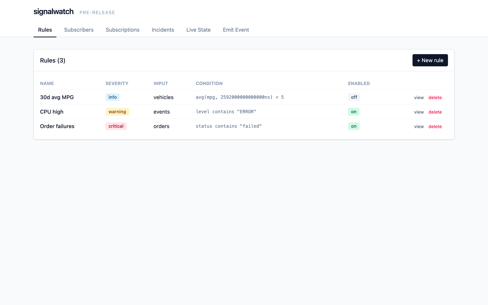
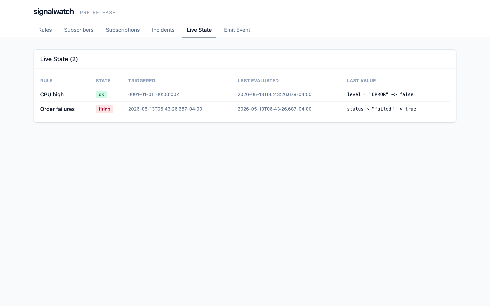
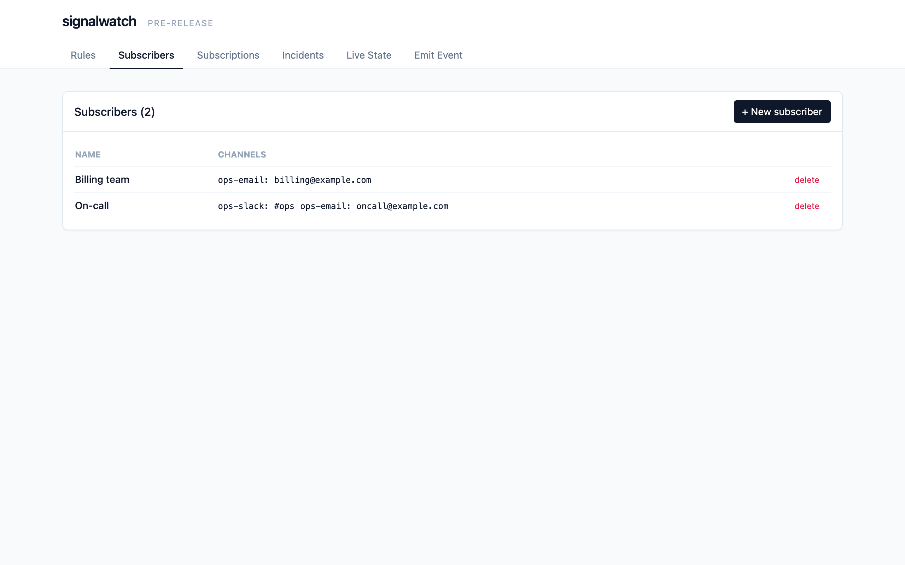
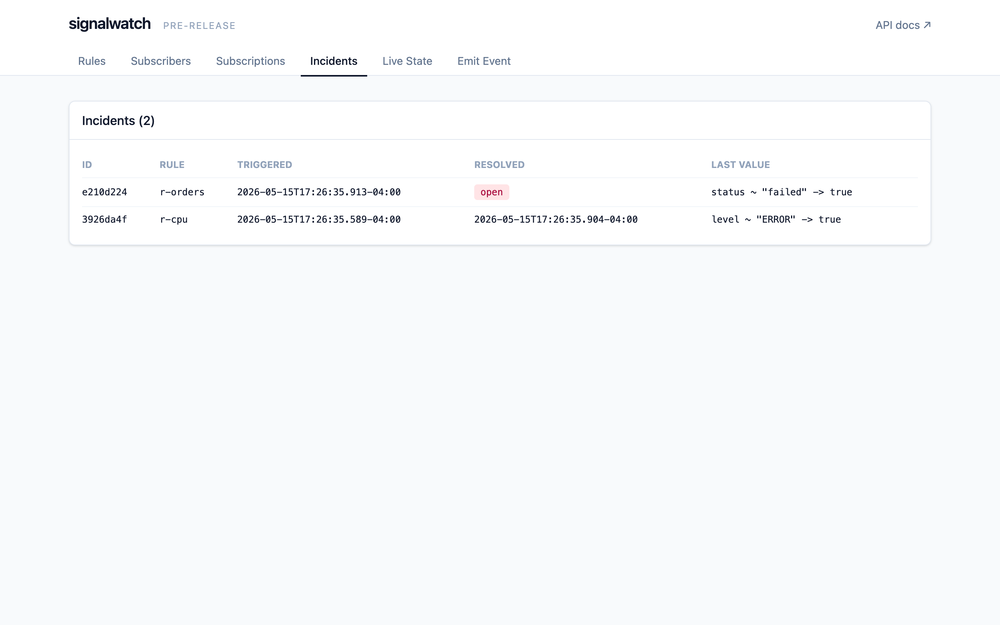

# signalwatch

> ⚠️ **Pre-alpha.** Active development on a feature branch. No released versions yet — `main` is the only supported branch and breaking changes are expected before `v0.2.0`. See [`docs/PI-PLAN.md`](./docs/PI-PLAN.md) for what's in flight.

An open-source alert and notifications framework. Define rules over pushed events, scheduled SQL queries, scraped metrics, or message-queue streams. Notify subscribers on Slack, email, or any webhook. Ships as a single-binary service with a bundled UI, or as a Go library embeddable into your own application.

## Why

Most alerting tools assume your alerts come from one place — Prometheus metrics, log streams, or a SaaS event pipeline. signalwatch is built around the idea that alerts have many sources:

- An app pushes an event when a customer hits an error path.
- A SQL query against your operational database returns rows.
- The average MPG on a vehicle drops below 5 over the last 30 days.
- A queue message arrives matching a regex.

One tool, one rule model, one subscriber model. Pluggable everywhere.

## Highlights

- **One engine, two deploy shapes.** The engine is a Go library; the service binary is a thin wrapper around the same engine that adds an HTTP API and a bundled React UI.
- **Pluggable everything.** Inputs (event/SQL/scrape/stream), stores (SQLite/Postgres/MySQL/DuckDB), and channels (SMTP/Slack/webhook) are small Go interfaces — bring your own.
- **Per-subscription dwell, dedup, and repeat.** Different humans want different things from the same rule. signalwatch handles this on the subscription, not the rule.
- **SQLite by default.** Pure-Go driver, single-file binary, zero ops to get started.

## Status

| Layer | State |
|---|---|
| Engine, dispatcher (dwell/dedup/repeat), three channels (SMTP/Slack/webhook), three inputs (event/SQL/scrape), HTTP API, embedded UI, CLI | landed |
| SQLite + Postgres + MySQL stores | landed (PI 1, sprints 4–5) |
| Kafka / SQS / RabbitMQ stream inputs | landed (PI 1, sprint 6) |
| Shared-token API auth + UI login gate | landed (PI 1, sprint 6) |
| Cross-driver store conformance suite (`internal/store/storetest`) | landed |
| 96.3% test coverage; 15-gate CICD on every PR | landed |
| Public repo, branch-protected `main` | landed |
| `v0.2.0` release tag | pending (PI 1 close) |

Full roadmap: [`docs/ROADMAP.md`](./docs/ROADMAP.md). Active sprint: [`docs/PI-PLAN.md`](./docs/PI-PLAN.md). What landed since v0.1: [`CHANGELOG.md`](./CHANGELOG.md).

## Quickstart (local development)

```bash
git clone https://github.com/ryan-evans-git/signalwatch
cd signalwatch
make build         # builds the React UI then the Go binaries
./bin/signalwatch --config examples/config.yaml
```

Open `http://localhost:8080/` for the UI. Push events to `http://localhost:8080/v1/events`.

### Locking down the API

By default `signalwatch` listens on the loopback interface and serves the API unauthenticated — fine for single-tenant local dev. For shared deployments, set a bearer token via `SIGNALWATCH_API_TOKEN`:

```bash
export SIGNALWATCH_API_TOKEN=$(openssl rand -base64 32)
./bin/signalwatch --config examples/config.yaml
```

Every `/v1/*` request must now carry `Authorization: Bearer <token>`. `/healthz` and `/v1/auth-status` stay open. The bundled UI prompts for the token on first load and stores it in `localStorage`. Per-user RBAC, named tokens, expiry, and SSO are post-PI-1 (see [`docs/ROADMAP.md`](./docs/ROADMAP.md)).

### Screenshots

A walkthrough of the bundled UI lives in [`docs/screenshots/`](./docs/screenshots/) and is rendered inline below. Regenerate the PNGs by running `make screenshots` (requires Docker for the binary and Node for Playwright).

| | |
|---|---|
|  |  |
|  |  |

A minimal `config.yaml`:

```yaml
http:
  addr: 127.0.0.1:8080

store:
  driver: sqlite
  dsn: file:./signalwatch.db?_pragma=journal_mode(WAL)

channels:
  - name: ops-email
    type: smtp
    smtp:
      host: localhost
      port: 1025
      from: alerts@example.com
  - name: ops-slack
    type: slack
    slack:
      webhook_url: https://hooks.slack.com/services/XXX/YYY/ZZZ
  - name: ops-pagerduty
    type: pagerduty
    pagerduty:
      routing_key: ${SIGNALWATCH_PAGERDUTY_ROUTING_KEY}  # 32-char integration key, see PagerDuty UI
  - name: ops-teams
    type: teams
    teams:
      webhook_url: https://outlook.office.com/webhook/.../IncomingWebhook/...
```

Available channel `type`s: `smtp`, `slack`, `webhook`, `pagerduty`, `teams`. `pagerduty` uses the Events API v2 (trigger / resolve mapped from rule kind); subscribers can override the routing key via their channel binding's `address`. `teams` uses an incoming-webhook URL.

See [`examples/`](./examples) for embedding the engine as a library, and [`docs/RULES.md`](./docs/RULES.md) for the rule reference.

## Documentation

- [`docs/ARCHITECTURE.md`](./docs/ARCHITECTURE.md) — package layout and design rationale
- [`docs/RULES.md`](./docs/RULES.md) — rule condition reference
- [`docs/SUBSCRIPTIONS.md`](./docs/SUBSCRIPTIONS.md) — subscriber and subscription model
- [`docs/ROADMAP.md`](./docs/ROADMAP.md) — versioning intent
- [`docs/PI-PLAN.md`](./docs/PI-PLAN.md) — active sprint
- [`CONTRIBUTING.md`](./CONTRIBUTING.md) — development workflow + CI gates
- [`SECURITY.md`](./SECURITY.md) — vulnerability reporting

## License

[Apache 2.0](./LICENSE)
